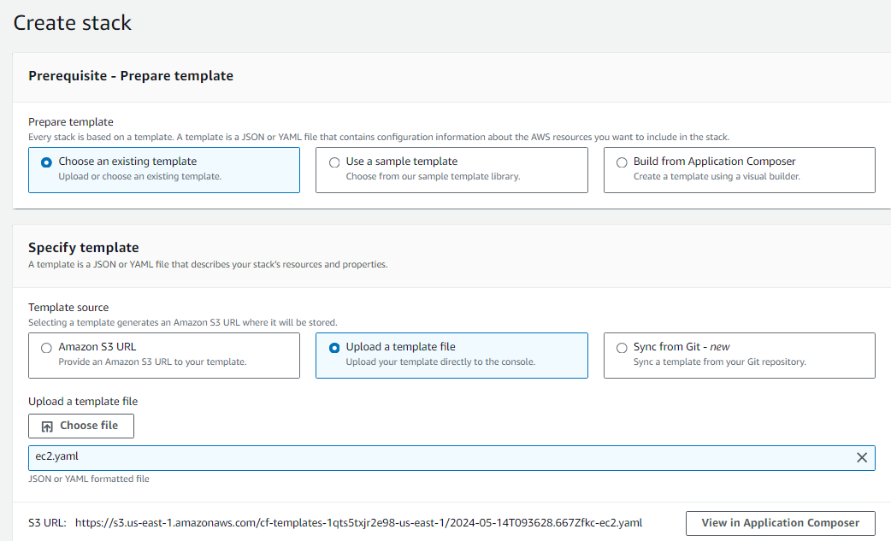
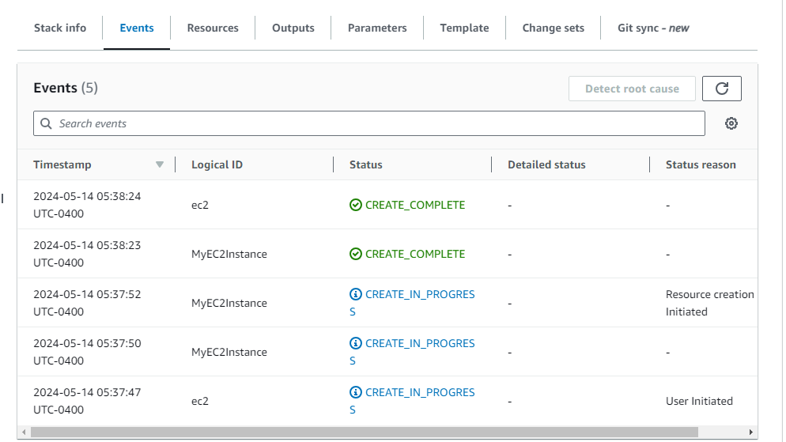
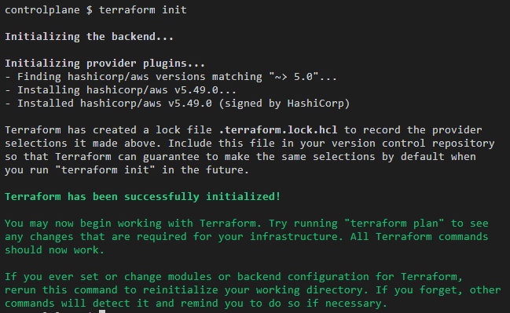
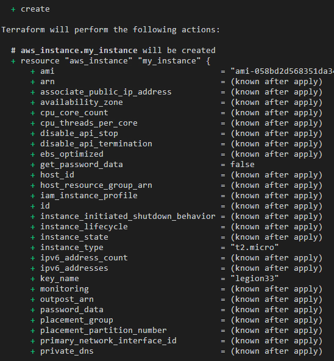
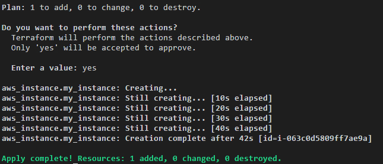

# Proyecto de Despliegue de AWS EC2

Este proyecto demuestra cómo desplegar instancias Amazon EC2 utilizando tanto CloudFormation como Terraform.

## Tabla de Contenidos
- [¿Qué es AWS?](#qué-es-aws)
- [¿Qué es EC2?](#qué-es-ec2)
- [Tipos de Instancias](#tipos-de-instancias)
- [Formas de Crear una Instancia EC2](#formas-de-crear-una-instancia-ec2)
- [Parámetros Principales de EC2](#parámetros-principales-de-ec2)
- [Estructura del Proyecto](#estructura-del-proyecto)
- [Creación de EC2 con CloudFormation](#creación-de-ec2-con-cloudformation)
- [Creación de EC2 con Terraform](#creación-de-ec2-con-terraform)

## ¿Qué es AWS?

AWS (Amazon Web Services) es una plataforma de servicios en la nube ofrecida por Amazon. Proporciona una amplia gama de servicios de computación, almacenamiento, bases de datos, análisis, aprendizaje automático, inteligencia artificial, IoT (Internet de las cosas), seguridad, entre otros.

## ¿Qué es EC2?

EC2 (Elastic Compute Cloud) es un servicio de computación en la nube que proporciona capacidad informática escalable en la nube. Permite a los usuarios ejecutar máquinas virtuales (instancias) en la infraestructura de AWS. Estas instancias pueden ser configuradas con diversos sistemas operativos, tamaños de CPU, memoria, almacenamiento y otros recursos según las necesidades del usuario.

## Tipos de Instancias

Hay muchos tipos de instancias EC2 que varían en diferentes componentes como red, CPU, memoria, almacenamiento, etc. Dependiendo de la variación, cambiará su nombre:

- `T2`: Propósito General - Desarrollo, pruebas, cargas de trabajo pequeñas
- `C5`: Optimizado para Cómputo - Análisis de datos, procesamiento por lotes
- `R5`: Optimizado para Memoria - Bases de datos en memoria, análisis de datos
- `I3`: Optimizado para Almacenamiento - Bases de datos NoSQL, análisis intensivos en disco
- `P3`: Cómputo Acelerado - Modelado 3D, aprendizaje profundo
- `H1`: Optimizado para Almacenamiento - Procesamiento de datos en paralelo, análisis de registros

## Formas de Crear una Instancia EC2

Una instancia EC2 puede desplegarse a través de varios métodos:

- **Interfaz Web (GUI)**: Acceso a la consola de AWS a través de un navegador web
- **Terraform**: Herramienta de Infraestructura como Código (IaC) que permite definir y gestionar la infraestructura de AWS de manera declarativa
- **CloudFormation**: Permite crear y gestionar recursos de manera automatizada utilizando plantillas de infraestructura
- **SDK** (Kit de Desarrollo de Software): AWS proporciona SDKs para varios lenguajes de programación, como Python, Java, Node.js, etc.

## Parámetros Principales de EC2

- `image-id`
- `instance-type`
- `key-name`
- `security-group-ids`
- `subnet-id`

## Estructura del Proyecto
```
.
├── Cloudformation-code/
│   └── main.yaml
├── terraform-code/
│   ├── main.tf
│   ├── variables.tf
│   └── terraform.tfvars
└── README.md
```
## Creación de EC2 con CloudFormation

1. Navega al directorio `Cloudformation-code`
2. Revisa el archivo `main.yaml`
3. Ve a AWS CloudFormation en la Consola de AWS
4. Crea una nueva pila y sube el archivo `main.yaml`

Para una guía visual del proceso, consulta las siguientes imágenes:
- 
- 
- 

## Creación de EC2 con Terraform

1. Navega al directorio `terraform-code`
2. Revisa los archivos de Terraform:
   - `main.tf`: Define el recurso de la instancia EC2
   - `variables.tf`: Declara las variables de entrada
   - `terraform.tfvars`: Establece los valores para las variables

3. Inicializa Terraform:
   ```
   terraform init
   ```
   

4. Planifica el despliegue:
   ```
   terraform plan
   ```
   

5. Aplica los cambios:
   ```
   terraform apply
   ```
   
   

Para ver el contenido de los archivos de Terraform, consulta los archivos en el directorio `terraform-code`.
