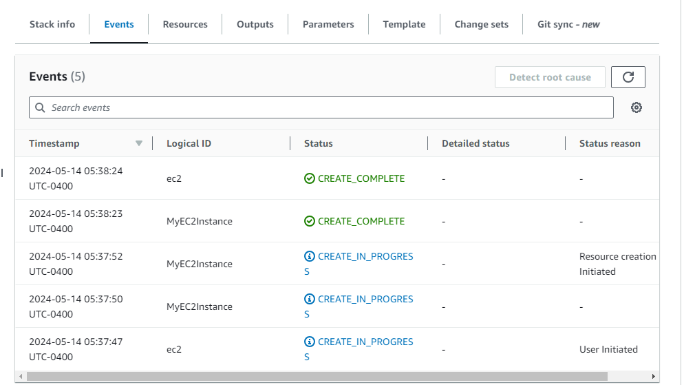
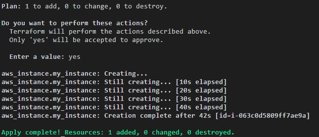
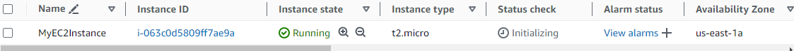

# AWS EC2 Deployment Project

This project demonstrates how to deploy Amazon EC2 instances using both CloudFormation and Terraform.

## Table of Contents
- [What is AWS?](#what-is-aws)
- [What is EC2?](#what-is-ec2)
- [Instance Types](#instance-types)
- [Ways to Create an EC2 Instance](#ways-to-create-an-ec2-instance)
- [Main EC2 Parameters](#main-ec2-parameters)
- [Project Structure](#project-structure)
- [Creating EC2 with CloudFormation](#creating-ec2-with-cloudformation)
- [Creating EC2 with Terraform](#creating-ec2-with-terraform)

## What is AWS?

AWS (Amazon Web Services) is a cloud services platform offered by Amazon. It provides a wide range of computing, storage, database, analytics, machine learning, artificial intelligence, IoT (Internet of Things), security, and other services.

## What is EC2?

EC2 (Elastic Compute Cloud) is a cloud computing service that provides scalable computing capacity in the cloud. It allows users to run virtual machines (instances) on AWS infrastructure. These instances can be configured with various operating systems, CPU sizes, memory, storage, and other resources according to user needs.

## Instance Types

There are many EC2 instance types that vary in different components such as network, CPU, memory, storage, etc. Depending on the variation, their name will change:

- `T2`: General Purpose - Development, testing, small workloads
- `C5`: Compute Optimized - Data analysis, batch processing
- `R5`: Memory Optimized - In-memory databases, data analysis
- `I3`: Storage Optimized - NoSQL databases, disk-intensive analytics
- `P3`: Accelerated Computing - 3D modeling, deep learning
- `H1`: Storage Optimized - Parallel data processing, log analysis

## Ways to Create an EC2 Instance

An EC2 instance can be deployed through several methods:

- **Web Interface (GUI)**: Access the AWS console through a web browser
- **Terraform**: Infrastructure as Code (IaC) tool that allows you to define and manage AWS infrastructure declaratively
- **CloudFormation**: Allows you to create and manage resources automatically using infrastructure templates
- **SDK** (Software Development Kit): AWS provides SDKs for various programming languages, such as Python, Java, Node.js, etc.

## Main EC2 Parameters

- `image-id`
- `instance-type`
- `key-name`
- `security-group-ids`
- `subnet-id`

## Project Structure

```
.
├── Cloudformation-code/
│   └── main.yaml
├── terraform-code/
│   ├── main.tf
│   ├── variables.tf
│   └── terraform.tfvars
└── README.md
```

## Creating EC2 with CloudFormation

1. Navigate to the `Cloudformation-code` directory
2. Review the `main.yaml` file
3. Go to AWS CloudFormation in the AWS Console
4. Create a new stack and upload the `main.yaml` file

For a visual guide of the process, refer to the following images:
- 
- 
- 

## Creating EC2 with Terraform

1. Navigate to the `terraform-code` directory
2. Review the Terraform files:
   - `main.tf`: Defines the EC2 instance resource
   - `variables.tf`: Declares input variables
   - `terraform.tfvars`: Sets values for the variables

3. Initialize Terraform:
   ```
   terraform init
   ```
   

4. Plan the deployment:
   ```
   terraform plan
   ```
   

5. Apply the changes:
   ```
   terraform apply
   ```
   
   

For the contents of the Terraform files, please refer to the files in the `terraform-code` directory.

## Contributing

Contributions are welcome! Please feel free to submit a Pull Request.

## License

This project is licensed under the MIT License - see the [LICENSE.md](LICENSE.md) file for details.
